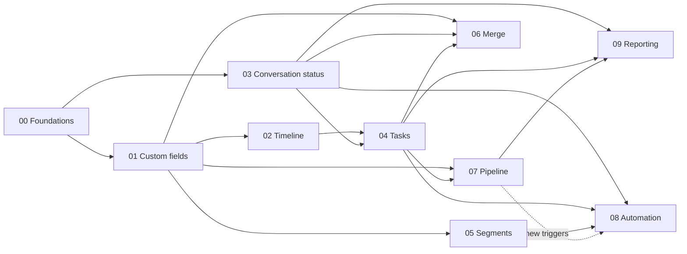

# WA CRM — CRM Feature Plans

This folder holds one implementation plan per CRM feature. The plans are written against the codebase as of commit `eaf1aae` plus the local rebrand to WA CRM. They are **aware of each other**: shared building blocks are defined once in [`00-shared-foundations.md`](00-shared-foundations.md), and every feature plan names what it consumes and what it provides.

> These files live outside `docs/src/content`, so the Starlight docs site does not publish them.

> **Read [`10-system-integration.md`](10-system-integration.md) first.** It reviews every plan against the existing code. It defines the **Phase 0 platform spine (S1–S12)**, which makes the features one system, and lists fix-first defects, including missing server-side permission checks. Where it conflicts with an older statement in plans 00–09, the integration review wins; each plan ends with an *Integration addendum* summarising the changes.

## Plans and priority

| # | Plan | Priority | Phase | Effort* | Depends on | Unlocks |
|---|------|----------|-------|---------|-----------|---------|
| 10 | [System integration review & platform spine](10-system-integration.md) | **P0 — first** | 0 | 5–6 w | — | everything |
| 00 | [Shared foundations](00-shared-foundations.md) | **P0** | 0 → 4 (incremental) | ~5 w total | 10 | everything |
| 01 | [Contact record & custom fields (Contacts module)](01-contact-custom-fields.md) | **P0** | 1 | 3 w | F1 F2 F3 F6 F7 | 02 05 06 08 09 |
| 03 | [Conversation status](03-conversation-status.md) | **P0** | 1 | 3 w | F1 F2 F3 F4 F5 F9 | 04 08 09 |
| 02 | [Contact profile & timeline](02-contact-profile-timeline.md) | **P1** | 2 | 2 w | 01 03, F3 F6 F8 | 04 06 07 (panels) |
| 04 | [Tasks & follow-ups](04-tasks-follow-ups.md) | **P1** | 2 | 2.5 w | 02 03, F2 F3 F4 F5 F6 F9 | 06 07 08 09 |
| 05 | [Segments (saved filters) & campaign targeting](05-segments.md) | **P1** | 2 | 2.5 w | 01, F4 F6 F8 F10 | 08 09 |
| 06 | [Duplicate detection & merge](06-duplicate-merge.md) | **P2** | 3 | 2.5 w | 01 02 03 04, F2 F3 F7 | clean data for 05 08 09 |
| 08 | [Automation on CRM events](08-automation.md) | **P2** | 3 | 4 w | 01 03 04 05, F2 F4 F5 F6 F10 F11 | — |
| 07 | [Pipeline / deals (Kanban)](07-pipeline-deals.md) | **P3** (P1 for sales-led orgs) | 4 | 3 w | 01 02 04, F2 F3 F6 F9 F11 | 08 triggers, 09 funnels |
| 09 | [CRM reporting](09-crm-reporting.md) | **P3** (quick win after 03) | 4 | 2.5 w | 01 03 04 07, F3 F9 | — |

\* Effort is rough, for one full-stack engineer familiar with the codebase, including tests. Parallel work across two engineers compresses the phases.

### Why this order

0. **Phase 0 — platform spine (P0, see plan 10).**
   - server-side permission enforcement
   - webhook signing fix
   - transactional event outbox
   - one messaging path (including the campaign worker) with `sender_type`
   - the Contact Lifecycle service
   - transfer service with per-contact locking
   - entity reference integrity
   - schedule/timezone package
   - shared frontend building blocks

   Without these, every feature would hook incomplete code paths and inherit data-integrity and security defects.
1. **Phase 1 — make the contact and the conversation real (P0).** Custom fields turn contacts into records. Conversation status gives agents a workload model and fixes the half-applied SLA. Nearly every later feature filters on fields or conversation state, so these come first.
2. **Phase 2 — the CRM core (P1).** Timeline turns scattered data into one story per contact. Tasks is the single biggest step from "shared inbox" to CRM. Segments connect CRM data to WhatsApp campaigns.
3. **Phase 3 — data quality and leverage (P2).** Merge becomes necessary once imports and segments are in use. Automation multiplies the value of everything built so far, and needs tasks, segments and conversation events to exist.
4. **Phase 4 — sales and insight (P3).** Pipelines matter only for orgs that sell or book. Reporting is most useful once conversations, tasks and deals produce data. The response/resolution-time part of 09 can ship right after 03.

## Cross-plan contracts (single source of truth)

Every plan uses these names. Change them here first.

### New packages (Go)

| Package | Owner plan | Purpose |
|---|---|---|
| `internal/migrations` | F1 | Run-once, versioned data migrations and permission backfills |
| `internal/crmevents` | F2 | Domain event types, in-process publisher, sinks (activity, WS, webhooks, stream) |
| `internal/activity` | F3 | Writes and reads `contact_activities` |
| `internal/scheduler` | F4 | Periodic jobs with a Redis leader lock |
| `internal/notify` | F5 | In-app notifications |
| `internal/contactquery` | F6 | Filter AST → parameterised SQL for contacts |
| `internal/phoneutil` | F7 | Phone normalisation |
| `internal/messaging` | F10 | Send text/template outside HTTP handlers (server and worker) |
| `internal/customfields` | 01 | Field definitions, typed value validation |
| `internal/automation` | 08 | Rule triggers, policies, runs (actions come from `crmactions`) |
| `internal/contacts` (lifecycle) | 10 S2 | Single resolve/create/restore/delete path for contacts |
| `internal/transfers` | 10 S5 | Transfer operations with typed outcomes and per-contact locks |
| `internal/crmcontext` | 10 S6 | Builds the `contact.* / conversation.* / user.* / org.*` variable context |
| `internal/render` | 10 S6 | One template renderer with escaping, masking and a variable catalog |
| `internal/crmactions` | 10 S7 | Action library shared by automation, chatbot CRM nodes, keyword rules, slash commands, bulk actions |
| `internal/entityrefs` | 10 S8 | Reference registry for delete/rename/merge/org purge |
| `internal/orgseed` | 10 S8 | One seeding function for every org creation path and migration |
| `internal/schedule` | 10 S11 | Business hours and schedules in org timezone |

### New tables

| Table | Owner | Notes |
|---|---|---|
| `schema_migrations` | F1 | name, applied_at |
| `crm_event_outbox` | 10 S3 | Events written in the same transaction; relayed to stream, WS and webhooks |
| `conversation_reads` | 10 S5 | Per-user read state (peek mode, per-user unread) |
| `role_permission_revocations` | 10 S1 | Grants a super admin removed are never re-added by backfills |
| `contact_activities` | F3 | Timeline events that have no table of their own |
| `notifications` | F5 | Per-user in-app notifications |
| `custom_field_definitions` | 01 | Has `entity_type` (`contact` now, `deal` in 07) |
| `custom_field_values` | 01 | Typed values (`value_text/number/date/option`) keyed by `entity_type` + `entity_id` |
| `conversations` | 03 | One open conversation per contact |
| `tasks`, `task_types` | 04 | |
| `segments` | 05 | Filter AST stored as JSONB |
| `webhook_deliveries` | F11 | Delivery log for webhooks and automation `call_webhook` actions |
| `contact_identities` | 06 | Alternate phones / BSUIDs / emails that resolve to a contact |
| `contact_duplicate_candidates`, `contact_merges` | 06 | Suggestions; merge snapshots for manual recovery |
| `pipelines`, `pipeline_stages`, `deals`, `deal_stage_history` | 07 | |
| `automation_rules`, `automation_runs`, `automation_contact_state` | 08 | Replaces the unused `notification_rules` |

Saved contact filters are `segments` (05); there is no separate saved-views table.

### Column additions to existing tables

| Table.column | Owner | Why |
|---|---|---|
| `contacts.phone_normalized` | F7 | Dedupe, import matching |
| `contacts.merged_into_id` | 06 | Merged contacts must not be auto-restored |
| `bulk_message_recipients.contact_id` | F8 | Timeline, segments, reporting |
| `messages.conversation_id` (exists, unused) | 03 | Start writing it as a UUID string of `conversations.id` |
| `messages.sender_type` | 10 S4 | contact / agent / bot / automation / campaign / system / api / echo |
| `conversations.handling`, `.origin_campaign_id`, `.whatsapp_account_id` | 10 S5 / 4.5 / S8 | Replaces `bot_active`; campaign attribution; account by ID |
| `call_logs.disposition`, `.notes`; `tasks.call_log_id` | 10 §4.4 | Call outcomes and callbacks |
| `conversation_notes.author_type` (+ nullable author) | 10 §4.1 | Automation-authored notes |
| `bulk_message_campaigns.audience_type`, `segment_id`, `param_mappings` | 05 | Segment targeting |
| `organizations.settings.timezone`, `.default_country_code`, `.currency` | F9 / F7 / 07 | Stored in the existing `settings` JSONB |
| `organizations.settings.inbox`, `.tasks`, `.automations`, `.campaigns.max_recipients`, `.features.pipeline` | 03 / 04 / 08 / 05 / 07 | Feature settings in the same JSONB |
| `users.settings.timezone`, `.notifications`, `.contacts_list.columns` | F9 / F5 / 01 | Per-user preferences |

### Domain events (F2 catalog)

Dotted names; the same string is used for the activity type, the outbound webhook event (when exposed) and the automation trigger.

| Event | Emitted by | Webhook? | Automation trigger? |
|---|---|---|---|
| `contact.created` (exists as webhook) | contactutil, CreateContact, import | yes | yes |
| `contact.updated` | contact update, field values | yes | via `contact.field_changed` |
| `contact.field_changed` | 01 | no (in `contact.updated`) | yes |
| `contact.lifecycle_stage_changed` | 01 | yes | yes |
| `contact.tag_added` / `contact.tag_removed` | tags update | yes | yes |
| `contact.assigned` | contacts assign | yes | yes |
| `contact.opt_out_changed` | marketing preference webhook | no | no |
| `contact.deleted` / `contact.restored` | Contact Lifecycle (10 S2) | yes | no |
| `chatbot.flow_completed` | chatbot runner (10 S7) | yes | yes |
| `call.missed` / `call.completed` / `call.transfer_no_answer` | calling manager via outbox (10 §4.4) | yes | yes |
| `campaign.replied` | conversation service (10 §4.5) | yes | yes |
| `conversation.sla_breached` / `.sla_escalated` | SLA job | yes | yes |
| `custom_action.executed` | custom actions (10 §4.6) | no | no |
| `contact.merged` | 06 | yes | no |
| `conversation.created` / `.status_changed` / `.assigned` | 03 | yes | yes |
| `time.no_customer_reply` / `time.no_agent_reply` / `time.date_field` (synthetic) | 08 scheduler job | no | yes (time triggers) |
| `transfer.created` / `.assigned` / `.resumed` / `.expired` | existing + SLA | yes (expired is new) | no (use conversation events) |
| `message.incoming` / `message.outgoing` (exist) | existing | yes | no (keyword rules/chatbot own this) |
| `note.created` | notes | no | no |
| `task.created` / `.completed` / `.overdue` | 04 | yes | yes |
| `task.due` / `.updated` / `.cancelled` | 04 | no | `task.due` only |
| `deal.created` / `.stage_changed` / `.won` / `.lost` | 07 | yes | yes |
| `campaign.sent_to_contact` | worker (F8) | no | no |

### Permissions (new resources/actions)

| Resource | Actions | Default roles |
|---|---|---|
| `contact_fields` | read, write, delete | admin all; manager read/write; agent read |
| `contacts` (existing) | + `merge` | admin, manager |
| `tasks` | read, write, delete | admin/manager all; agent read/write (own + accessible contacts) |
| `segments` | read, write, delete | admin/manager all; agent read |
| `pipelines` | read, write, delete | admin all; manager read/write; agent read |
| `deals` | read, write, delete | admin/manager all; agent read/write |
| `automations` | read, write, delete | admin all; manager read/write |
| `reports` | read | admin, manager |

Conversation status changes use the existing `chat:write`; assignment uses `chat.assign:write`. Existing orgs receive new permissions through the F1 backfill (the current seeder does not add permissions to roles that already have some).

### WebSocket events (new)

`contact_updated` (defined today but never sent), `contact_merged`, `contact_activity_created`, `custom_fields_updated`, `conversation_updated`, `task_updated`, `notification_created`, `deal_updated`, `segment_count_updated`.

Delivery model (10 S10):
- clients `subscribe` to topics (`contact:<id>`, `conversation:<id>`, `board:<pipeline>`) instead of the single-valued `set_contact`
- payloads carry ids and non-sensitive fields; content-bearing events target only users who can see the record

### Frontend navigation (target — superseded by 10 §4.9)

- **Main:** Home (agents) / Dashboard, **Inbox** (renamed Chat, unread badge), **Contacts**, **Tasks** (due badge)
- **Sales:** **Pipeline** (07, feature-flagged)
- **Messaging:** Campaigns, Templates, Flows
- **Automation:** Chatbot (Transfers child removed; queue absorbed into Inbox), **Automations** (08)
- **Calling:** unchanged
- **Analytics:** Agent Analytics, **CRM Reports** (09), Meta Insights
- **Settings:** existing children minus Contacts, plus **Inbox** (SLA, hours, reopen/auto-resolve). Contact fields, task types and pipelines are configured inside their modules
- **Sidebar bottom:** **notification bell** next to the user menu (F5)

`src/router/index.ts` keeps a hand-maintained `navigationOrder` list that must be updated together with `navigation.ts` for every new module.

## Existing defects found during research

These are pre-existing issues that the plans either fix or must work around. Items marked **fix-first** should be done before or in Phase 1.

| Defect | Where | Handled in |
|---|---|---|
| **fix-first (security, verified)** Most handlers have **no server-side permission checks** (campaigns, templates, webhooks, custom actions, canned responses, roles, messages, flows). An agent without those permissions gets 200 on their APIs | handler files; no-op RBAC hook `main.go:568-579` | 10 S1 |
| **fix-first** Campaign worker bypasses `SendOutgoingMessage` | `worker.go:161` | 10 S4 |
| Contacts auto-restored by sends/reactions/echoes/calls; accounts referenced by name with no rename cascade; deleted template crashes worker; no unique active-transfer index | see 10 §2 X4–X7 | 10 S2, S5, S8 |
| **fix-first** Webhook secrets are dropped on cache hits (`Webhook.Secret` is `json:"-"` but the cache round-trips through JSON), so cached sends go out **unsigned** | `models.go:262`, `cache.go:268-290` | F11 |
| **fix-first** Scheduled campaigns never start (nothing polls `scheduled_at`) | `campaigns.go:180`, `constants.go:135` | F4 |
| SLA processor runs on every server replica (no lock) and once per `chatbot_settings` row | `sla_processor.go`, `main.go:280` | F4, 03 |
| Soft-deleted contacts still own their phone (non-partial unique index) and are auto-restored on inbound | `contactutil.go:18`, `postgres.go:243` | 06 |
| CSV import fails with a unique violation on soft-deleted duplicates and ignores `+` variants | `import_export.go:131` | 01, F7 |
| Send-template-by-phone creates contacts without stripping `+` | `messages.go:789-804` | F7 |
| Contact list computes unread count with one query per contact (N+1); sort is client-side only | `contacts.go:155` | F6 |
| `new_message` WS event triggers a full contact refetch | `websocket.ts:375` | 03 |
| Tag changes and contact assignment are not audited and emit no events | `contacts.go:1107,1260` | F3 |
| `AvgFirstResponseMins` / `AvgResponseMins` never populated; queue time uses `updated_at` | `agent_analytics.go:237` | 03, 09 |
| Widget whitelist inconsistencies (contacts `is_read` filter dropped; transfers `source` group-by empty for bar/pie) | `widgets.go:990-1082` | 09 |
| Custom action JavaScript runs in goja without a timeout | `custom_actions.go:495` | noted in 08 (do not reuse) |
| 24-hour service window is not enforced server-side | `messages.go:147` | F10 (enforced for automated sends) |
| Webhook deliveries are not persisted (lost on restart) | `webhook_dispatch.go:66` | F11 (optional delivery log) |

## Conventions used by every plan

- **Backend:** routes in `setupRoutes` (`cmd/wacrm/main.go`); handlers modelled on `internal/handlers/canned_responses.go` (`requireAuth` → `parsePagination` → query → DTO → `listEnvelope`, `logAudit` on mutations); new models added to `GetMigrationModels`, `getIndexes`, **and** `test/testutil/db.go` `runMigrations`.
- **Frontend:** list pages copy `views/settings/TeamsView.vue` (PageHeader + DataTable + `useSearchPagination`); detail pages copy `TeamDetailView.vue` (`DetailPageLayout`, `useUnsavedChangesGuard`, `AuditLogPanel`); services and types in `src/services/api.ts`; realtime through a new `case` in `src/services/websocket.ts`; strings in `src/i18n/locales/en.json` (other locales fall back to English).
- **Tests:** handler tests in `internal/handlers/*_test.go` (package `handlers_test`, `newTestApp`, `testutil` fixtures, needs `TEST_DATABASE_URL` + `TEST_REDIS_URL`); e2e page objects in `frontend/e2e/pages` and CRUD bodies from `e2e/framework/crud.ts`.
- **Every plan** ends with acceptance criteria. A plan is "done" only when its criteria pass, its migrations are idempotent on an existing database, and existing e2e suites stay green.
